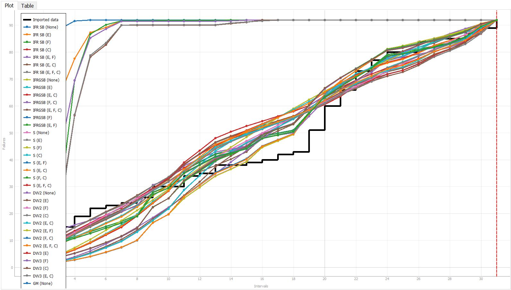
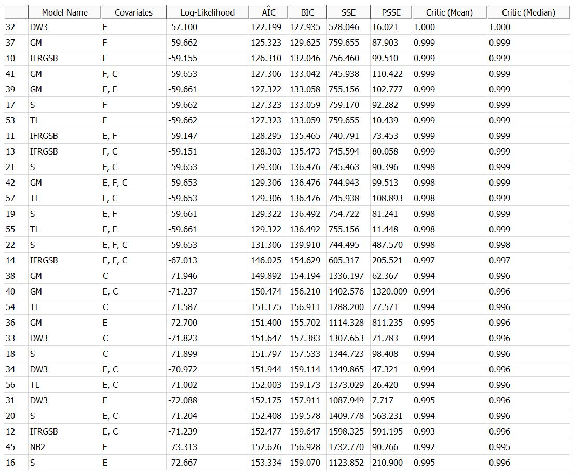
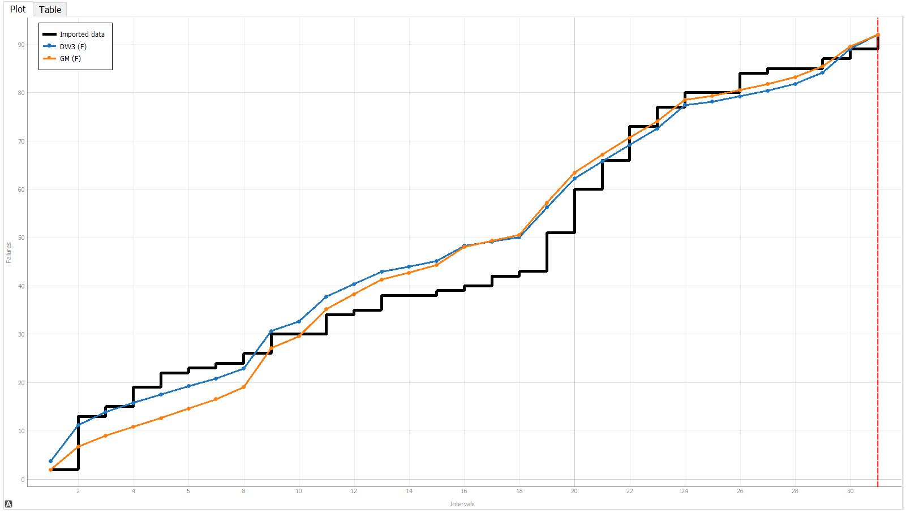
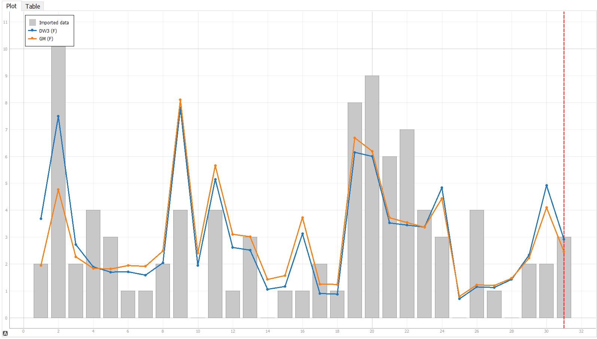
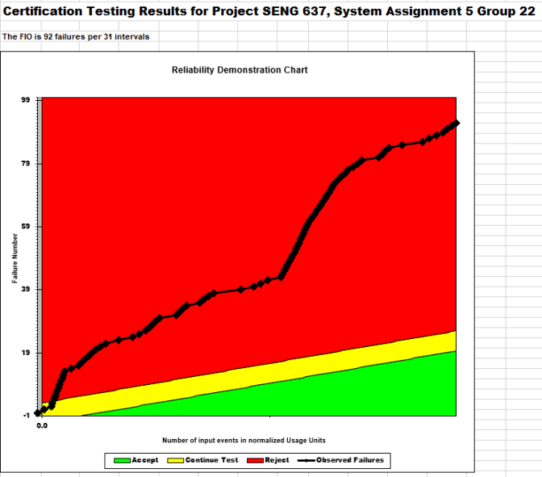
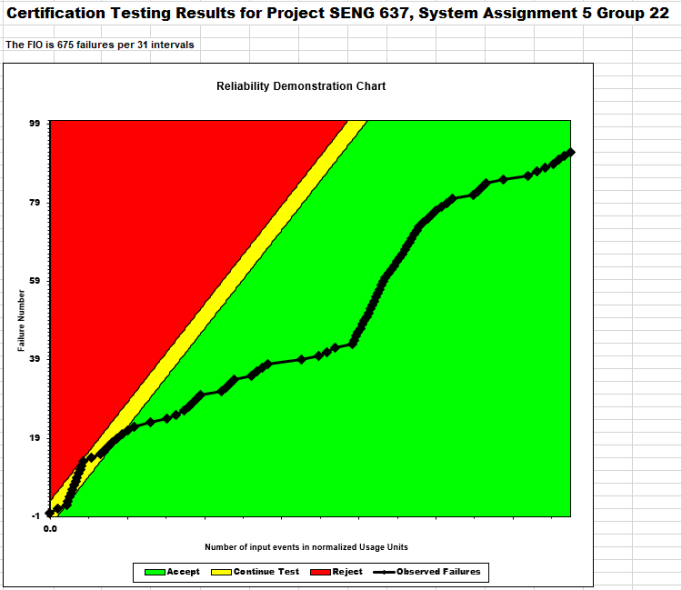
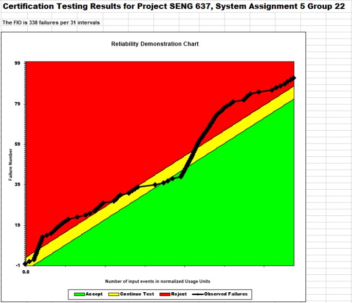
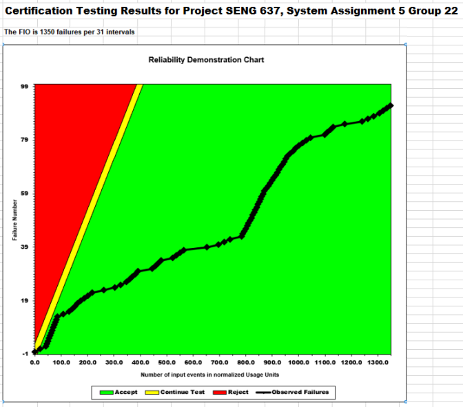
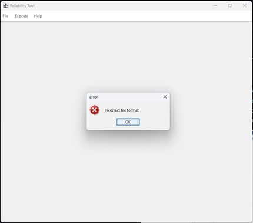

**SENG 637- Dependability and Reliability of Software Systems***

**Lab. Report \#5 – Software Reliability Assessment**

| Group: 22      |
|-----------------|
| Student 1 Jeremy Sugimoto                |   
| Student 2 Matt De Filippo             |   
| Student 3 Momin Muhammad               |   
| Student 4 Redge Santillan                |   
| Student 5 Shad Sajid               |  

# Table of Contents
1. [Introduction](#1-introduction)
2. [Assessment Using Reliability Growth Testing](#2-assessment-using-reliability-growth-testing)
3. [Assessment Using Reliability Demonstration Chart](#3-assessment-using-reliability-demonstration-chart)
4. [Comparison of Results](#4-comparison-of-results)
5. [Discussion on Similarity and Differences of the Two Techniques](#5-discussion-on-similarity-and-differences-of-the-two-techniques)
6. [How the team work/effort was divided and managed](#6-how-the-team-workeffort-was-divided-and-managed)
7. [Difficulties encountered, challenges overcome, and lessons learned](#7-difficulties-encountered-challenges-overcome-and-lessons-learned)
8. [Comments/feedback on the lab itself](#8-commentsfeedback-on-the-lab-itself)

# 1 Introduction

In this assignment the team will perform Reliability Growth Testing and use a Reliability Demonstration Chart to evaluate the reliability of a hypothetical system using failure data collected during integration testing. 

This involves measuring key reliability metrics such as failure rate, Mean Time To Failure, and overall system reliability using various assessment tools to graphically represent failure rates and system reliability. The team will then compare and discsuss the differences between these techniques within this report.

# 2 Assessment Using Reliability Growth Testing

C-SFRAT was our primary tool for Reliability Growth Testing due to its intuitive UI, making comparing models of varying variate combinations much easier.
Our initial approach was to import the failure dataset into C-SFRAT using every model and covariate combination to determine the best model.

The image below displays all the models on a single mean value function (MVF) graph in C-SFRAT:

Next, to determine the best model to use, we evaluated the Akaike Information Criterion (AIC) and the Bayesian Information Criterion (BIC). We selected AIC because it measures both the goodness of fit of the model and its complexity. Derived from the log likelihood, AIC includes a penalty that increases with the number of parameters. Similarly, we considered BIC, which also measures the trade-off between model fit and complexity. Unlike AIC, BIC includes a penalty term that grows logarithmically with the sample size. Models with the lowest AIC or BIC are typically favored because they offer a balance of simplicity and accuracy. Therefore, AIC and BIC are the most effective criteria for determining the best-fitting model due to their balance of goodness-of-fit and penalization for increased model complexity.
When analyzing the model comparison table in C-SFRAT, we determined that the model with the lowest AIC and BIC values was the Discrete Weibull Type 3 (DW3) model using covariate F. This model had an AIC of 122.199 with a BIC of 127.935. The second best model was the Geometric Model (GM) with covariate F. This had an AIC of 125.323 and a BIC of 129.625.

The image below shows the Model Comparison page in C-SFRAT for all the models, filtered by the lowest AIC/BIC:

The MVF graph below shows the two best models (DW3 (F) and GM (F)):

Additionally, here is an intensity graph of the same two models (DW3 (F) and GM (F)):

After manually testing the ranges using these two models in the Model Comparison page in C-SFRAT, it was found that using a subset ranging from approximately 68-70% of the failure dataset had the lowest PSSE value for the DW3 model. This subset consists of 21 out of 31 data points in the full dataset. This can potentially be explained by the large increase in failures starting at around point 20 in the data as shown in the images above. 

The calculated failure rate and mean time to failure (MTTF) using the two models are shown below:
| Model | Failure Rate (F/interval) | MTTF (intervals)|
|----------|----------|----------|
| Original | 2.97| 0.337 |
| DW3 | 2.94| 0.341 |
| GM | 2.90| 0.344|

The failure rates were calculated by using the 21st point based on the range analysis and the last 10 points were predicted. The cumulative failures were divided by the 31st interval to obtain the failure rate. The inverse of this value was used to determine the MTTF. From these calculations it can be seen that the predicted values based on these two models are relatively accurate to the original dataset.

## Decision making based on given Target Failure Rate
Models such as DW3 can be used to predict the intervals where failure rates surpass a predefined threshold. This threshold is set by the monitoring team and the various models can be used to predict if the system under test (SUT) will exceed this threshold. In our case, if the failure rate threshold was set to 3, DW3 and GM both have predicted failure rates under that value at 2.94 and 2.90 respectively, indicating that the systems will pass the reliability assessment. If the threshold was set lower to 2.5 for example, decisions regarding system readiness and potential interventions would need to be carefully considered since these models would surpass the acceptable threshold limits. This underscores the critical role of predictive modeling in proactively managing software reliability, allowing teams to make informed decisions aligned with organizational objectives and user expectations. Furthermore, continuous monitoring and refinement of these models enable agile responses to evolving performance metrics, ensuring sustained reliability and user satisfaction.

## Advantages and Disadvantages of Reliability Growth Analysis
### Advantages
- Allows users to easily select from a set of predefined models and adjust ranges and covariate parameter values. This allows them to see which models/covariate combinations best fit the failure data by filtering options based on metrics such as AIC and BIC.
- Provides risk mitigation by providing a proactive approach to enhance system stability. This can help save time and money with failures such as bug fixes by providing an analytical method to better plan production and reduce system failure.
### Disadvantages
- This analysis depends on the quality of data available. Inaccurate data may skew results and negatively impact the analysis.
- Predictions are model and range dependent. There are also multiple variables that need to be accounted for which requires specialized knowledge and tools and this can be challenging to accurately implement.
- It is difficult to accurately forecast failures into the future. Software development is unpredictable by nature and many unforeseen issues can arise which would limit the effectiveness of RGT.

# 3 Assessment Using Reliability Demonstration Chart
To conduct RDC (Reliability Demonstration Chart) testing, we employed the RDC-11 Excel sheet to generate a range of Charts. This involved inputting our data into the Excel sheet to create visual representations of failure and reliability trends. By utilizing the RDC-11 tool, we aimed to analyze and interpret the performance and reliability metrics of the system under examination. Additionally, factors such as the discrimination ratio, developer's risk, and user's risk were also inputted into the tool. The default risk profile was used to set these factors for all the plots.

The default risk profile that was used:

- Discrimination Ratio: 2.0
- Developer's Risk: 0.1
- User's Risk: 0.1

Adjustments were necessary for the failure data prior to its graphical representation. Originally, the data depicted the number of failures per interval rather than the intervals between failures. To convert this, it was presumed that failures were evenly spaced within each interval. As an example, the original data appeared as `T=1` with `FC=2` and `T=2` with `FC=3`.

This led to the conversion of the data into intervals between failures. For example, when recording two failures at `T=1`, it would be reasonable to consider that the first failure happened at `T=0.5` and the second at `T=1`.

| Cumulative Failure Count | Time between failures | Cumulative Time |
| ------------------------ | --------------------- | --------------- |
| 1                        | 0.5                   | 0.5             |
| 2                        | 0.5                   | 1               |
| 3                        | 0.33                  | 1.33            |
| 4                        | 0.33                  | 1.67            |
| 5                        | 0.33                  | 2               |

## MTTF Calculation
FIO = FC/T

MTTF = 1/FIO

## RDC Plots

1. The initial graph displayed below represents the RDC chart, constructed using the derived Mean Time To Failure (MTTF) for the System Under Test (SUT). The calculation of MTTF is based on a Failure Intensity Objective (FIO) of 92 failures across 31 intervals, equating to 2.97 failures per interval, which subsequently yields an MTTF of 0.337.

2. The second illustration portrays the minimum MTTF required for the system to be deemed acceptable. This threshold was established by adjusting the FIO to the highest point before the SUT marginally qualifies for the acceptance zone. It was calculated that the maximum permissible FIO is 675 failures during 31 intervals, corresponding to 21.77 failures per interval, resulting in a minimum MTTF of 1 divided by 21.77, which is approximately 0.046.

3. The third graph showcases the scenario where the MTTF is set at double the minimum value (MTTF = 0.092) with a corresponding FIO of 10.89. Under these conditions, the plot fluctuates near the continuation threshold, occasionally crossing into the rejection zone.

4. The fourth diagram illustrates the situation when the MTTF is halved (MTTF = 0.023) with a resultant FIO of 43.55. In this configuration, the SUT promptly transitions into the acceptance region.

## Advantages and Disadvantages of RDC

**Advantages**

1. The chart is straightforward to interpret, aiding both users and developers in making informed decisions about the System Under Test (SUT) based on their risk tolerance. The RDC provides detailed graphical representations that assist in decision-making processes. Specifically, it helps in determining the optimal point during testing at which to either continue, halt, reject, or accept the test results based on the observed data.

2. Utilizing the Reliability Demonstration Chart (RDC) is both time and cost-effective. It simplifies the data processing and plotting stages, thereby facilitating a more efficient analysis process. The chart helps in determining whether additional testing is necessary, potentially saving time and resources if the SUT can be quickly accepted or rejected based on the reliability outcomes displayed.

**Disadvantages**

1. Determining the minimum Mean Time To Failure (MTTF) necessary for effective use of the RDC can be complex. An inaccurate MTTF estimation could render the entire chart ineffective and the conclusions drawn from it invalid.

2. The effectiveness of RDC heavily relies on the accuracy and completeness of the failure data collected during testing. Inaccurate data can lead to misleading conclusions about the system’s reliability.

3. The RDC does not allow for the calculation of an exact quantitative value concerning the reliability or availability of the SUT. This limitation can impede precise reliability assessments.

# 4 Comparison of Results

Reliability Growth Analysis (RGA) and Reliability Demonstration Chart (RDC) are two distinct methodologies used to assess software readiness for release, each with its strengths and limitations. 

In practical application, when comparing outcomes from RGA and RDC, using a consistent benchmark such as the minimum Mean Time to Failure (MTTFmin) is crucial. For instance, using an MTTFmin of 0.046 from the RDC section, the MTTF of the SUT from the RGA is 0.341, suggesting its acceptability. RDC's graphical output advantageously displays when observed failures fall within predefined accept or reject zones, facilitating more efficient decision-making regarding the continuation or cessation of testing. While both methods indicate increasing reliability of the SUT within their respective datasets, each technique has its specific optimization: RGA is better suited for analyzing failure trends over time, whereas RDC excels in making risk-based decisions about stopping testing. Despite these advantages, limitations exist in the visibility of the full dataset in RDC and the availability of models in the CASRE tool, which can affect comprehensive assessments.

# 5 Discussion on Similarity and Differences of the Two Techniques

Similarities and differences of Reliability Growth Testing and reliability assessment using Reliability Demonstration Chart are listed below.

### Similarities:
- Both methods aim to assess the reliability of software.
- Both methods use statistical techniques to analyze data from testing.

### Differences:
- Reliability Growth Testing uses historical failure data to make mathematical models that predict future failures, whereas Reliability Demonstration Chart checks if the historical failure data meets a target failure rate.
- Reliability Growth Testing involves creating plots of failure rate and reliability of SUT, whereas RDC involves creating a plot with historical and target failure rate or MTTF.

# 6 How the team work/effort was divided and managed

| Student | Section |
|----------|----------|
| Jeremy Sugimoto |  Assessment Using Reliability Demonstration Chart, Comparison of Results  |
| Matt De Filippo | Difficulties encountered, challenges overcome, and lessons learned, Comments/feedback on the lab itself   |
| Momin Muhammad | Discussion on Similarity and Differences of the Two Techniques, How the team work/effort was divided and managed  |
| Redge Santillan | Assessment Using Reliability Demonstration Chart, Comparison of Results |
| Shad Sajid    | Introduction, Assessment Using Reliability Growth Testing   |

# 7 Difficulties encountered, challenges overcome, and lessons learned

The team encountered several challenges throughout this assignment as outlined below:
1. We were not able to import the provided failure data into the SRTAT-SRE tool. When attempting to import, an “Incorrect file format!” error was thrown as shown below. We tried to navigate to the provided help page link, but the URL was not available. Attempting to reformat the input dataset also wouldn't work sometimes and other times the program would just crash. C-SFRAT was used instead which was able to run using the input data and offered a more intuitive approach.

2. We were not able to run the CASRE tool When the executable was run, we received the following error:

3. When one of our group members tried to run the C-SFRAT, they encountered Windows Defender and firewall issue stopping them from opening the program. Some of the tooling found in the other programs was also missing.

4. The RDC excel file had limited documentation and the macros within the file would often break. Significant modifications were required to display charts in the "R-Demo-Chart" page.
   
# 8 Comments/feedback on the lab itself
1. The guidelines provided for this assignment were not sufficiently detailed. It was difficult to understand how the tools (such as C-SFRAT and RDC) were to be used. 
2. There could have been more information provided on how to get some of the tools working such as SRTAT-SRE and CASRE (due to the issues noted in Section 7). This limited the tools we could on this assignment. 
